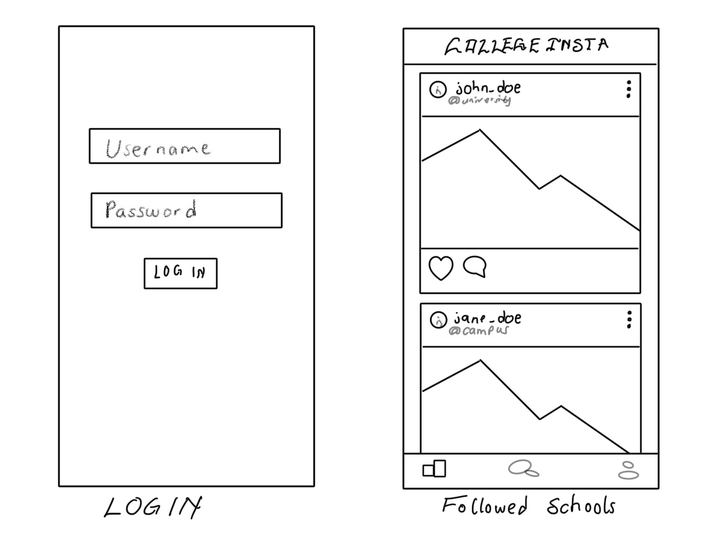
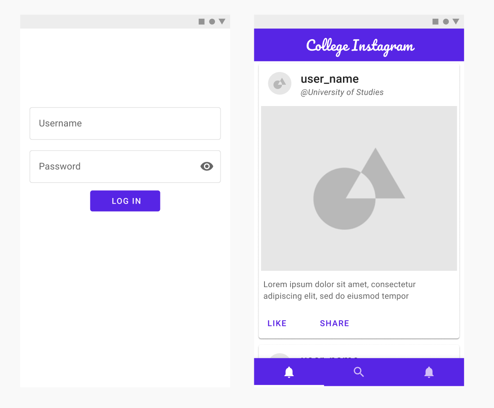

# Unit 8: Group Milestone

## UniGram

### Table of Contents

1. [Overview](#Overview)
1. [Product Spec](#Product-Spec)
1. [WireFrames](#WireFrames)

### Overview

#### Description

An Instagram-like social media app that allows universities/colleges and their enrolled students to host/post pictures and information relating to their campuses for
interested and prospective applicants.

#### App Evaluation

- **Category:** Social Networking / Education / University / Colleges
- **Mobile:** This would be primarily a Mobile app; however, it may be just as viable on a computer, such as tinder or other similar apps. The apps functionality is not only limited to mobile devices; however, the mobile version could potentially have more features.
- **Story:** Analyzes users information, such as location, intended majors/minors, financials, personal interests such as scholarships or financial aids, etc., and connects them to matching colleges and universities. Colleges and universities can control information and media contents posted on their page, and enrolled students can share their experiences on the school's page with permissions from the administrators.
- **Market:** Any individual could choose to use this app.
- **Habit:** The usage of this app can be as often or as unoften as the user wants, depending on:
  - how much they want to learn about their interested/intended colleges/universities,
  - what exactly they're looking for, and
  - if they find the information posted on the school's page helpful. Colleges/Universities can also edit/change information and media contents on their page as they desire and use the app for advertising and introducing their schools as much as they want or find it helpful.
- **Scope:** First, we would start with matching users to their universities/colleges. Then this could evolve into an experience sharing application as well to broaden its usage in which students can directly connect and socialize with some enrolled students at their matching universities/colleges.

### Product Spec

#### 1. User Stories (Required and Optional)

**Must-have Stories** (Required)

- User logs in to access previous pictures and profile
- User can choose their favourite school. Use can select the school to see
- User can follow and unfollow a school depending on their preference
- Specific users(current students and admin) can take a photo
- Profile pages for each user
- Settings (Accessibility, Notification, General, etc.)

**Nice-to-have Stories** (Optional)

- User can search a database of schools to view their lifestyle
- Most searched schools recommendation
- Direct messages to students who posted the pictures about their school

#### 2. Screen Archetypes

- Login
- Register - User signs up or logs in to their account
  - Users will have different viewing privileges and will have necessary access depending on how they register.
- Home Screen - this will contain pictures of the schools the user is following, or the on they have searched
- Photo capture screen(only available to some users with specific privileges)
- Profile Screen
  - Allows a user to upload a photo and fill in information that is interesting to them and others
- Settings Screen
  - Lets people change language, and app notification settings.

#### 3. Navigation

**Tab Navigation** (Tab to Screen)

- Home
- Photo (_available to particular users with specific privileges_)
- Search
- Profile

Optional:

- Chat screen

**Flow Navigation** (Screen to Screen)

- Forced Log-in -> Account creation if no login is available
- Random college pictures if the user follows no school
- Profile -> Text field to be modified.
- Settings -> Toggle settings

### WireFrames

#### [BONUS] Digital WireFrames & Mockups

#### [BONUS] Interactive Prototype

[Figma Prototype](https://www.figma.com/proto/6mE6wzLmnza2c3u9735k1M/UniInsta?node-id=14%3A1&scaling=min-zoom)
